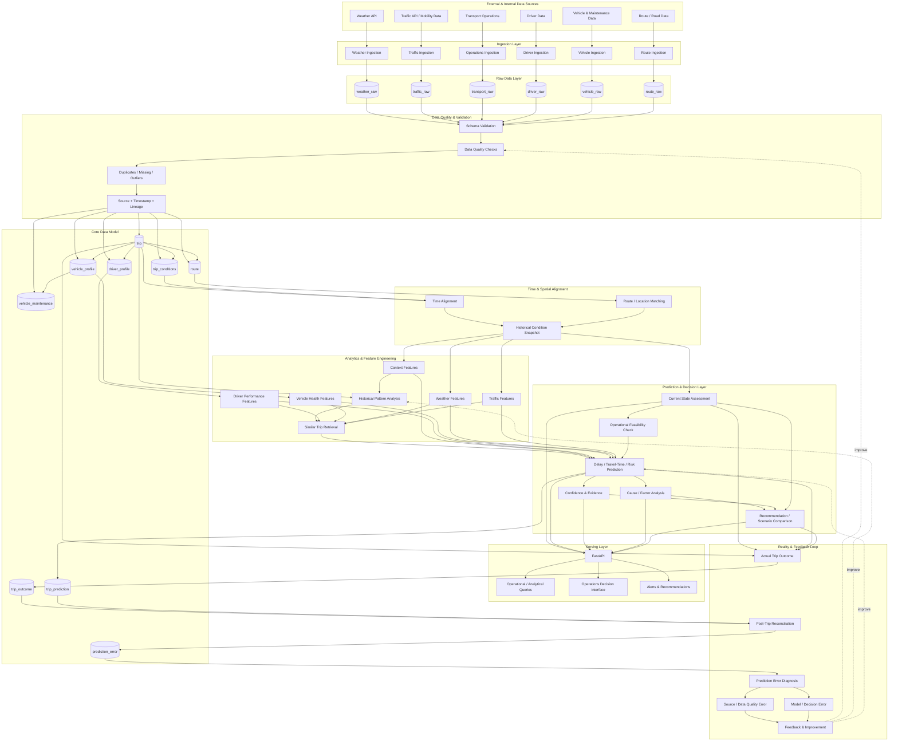

# MOBILITY_LOGISTIC

## OMIND Mobility Intelligence

A production-oriented Data & AI decision system for mobility and logistics operations.

The system is designed to answer a practical operational question:

> **How do weather, traffic, route, driver, vehicle, cargo, and time conditions affect transportation operations — and what should the operation do next?**

This project is intentionally built as an end-to-end engineering system rather than a standalone dashboard or machine-learning notebook.

---

## 1. Project Vision

OMIND Mobility Intelligence combines external mobility/environmental data with transportation operations data to build a historical, context-aware decision system.

The system should be able to:

- ingest external and internal data
- preserve raw source data
- validate and trace data quality
- align observations by time and route/location
- build a consistent operational data model
- retrieve historically similar trips and conditions
- analyze operational patterns
- assess the current operational state
- predict delay, travel time, and operational risk
- explain the main contributing factors
- compare possible operational scenarios
- store predictions and actual outcomes separately
- diagnose prediction errors
- feed verified failures and outcomes back into the system

The core engineering principle is:

```text
Observe → Understand → Predict → Decide → Act → Measure → Diagnose → Improve
```

---

## 2. Core Business Problem

Transportation decisions are rarely determined by a single variable.

A trip can be affected by combinations of:

- weather
- precipitation and visibility
- traffic volume and speed
- route characteristics
- departure time
- day of week and season
- driver experience and historical behavior
- vehicle type and condition
- maintenance history
- cargo characteristics
- incidents, road works, and closures
- unexpected operational events

A useful decision system therefore needs **context**, not isolated metrics.

The project aims to move from:

```text
"What is happening?"
```

toward:

```text
"Given what is happening now, what is likely to happen next,
why, how confident are we, and what should we do?"
```

---

## 3. System Scope

### External data

Potential external sources include:

- Weather APIs
- Traffic / mobility APIs
- Public transport and road datasets
- Route and road-network data
- Incident / road-work / closure data

### Internal operational data

The project uses a realistic operational model for:

- trips
- drivers
- vehicles
- maintenance
- routes
- cargo
- operational outcomes

When real company data is unavailable, internal operational data will be explicitly marked as **synthetic**. External environmental data can remain real and reproducible.

The architecture must never pretend synthetic data is real company data.

---

## 4. Architecture

The system is organized into the following layers:

```text
External & Internal Sources
            ↓
       Ingestion Layer
            ↓
        Raw Data Layer
            ↓
   Validation & Data Quality
            ↓
       Core Data Model
            ↓
 Time / Spatial Alignment
            ↓
 Analytics & Feature Engineering
            ↓
 Current State Assessment
            ↓
 Prediction & Decision Layer
            ↓
       Serving Layer
            ↓
       Actual Outcome
            ↓
 Prediction Error Diagnosis
            ↓
       Feedback / Improvement
```

The detailed architecture is maintained in:

- [`docs/architecture.md`](docs/architecture.md)

---

## 5. Master Data Flow



---

## 6. Architectural Principles

### 6.1 Raw data is immutable

Raw source observations should be preserved as received whenever practical.

We do not overwrite historical source truth simply because a later observation or correction exists.

### 6.2 Current state and historical context are different

Current conditions answer:

> What is happening now?

Historical data answers:

> What usually happens under similar conditions?

They are joined for analysis and prediction, not mixed into an ambiguous single state.

### 6.3 Time alignment is a first-class problem

Weather, traffic, and operational events do not necessarily arrive at the same timestamp.

Alignment rules must depend on the variable's semantics.

Examples:

- temperature → nearest observation or interpolation
- precipitation → interval aggregation
- traffic volume → interval average
- traffic level → mode / representative state
- incidents → existence within the relevant interval
- visibility → nearest or conservative interval statistic

### 6.4 Spatial alignment is equally important

A weather observation is only useful for a trip when its location can be meaningfully associated with the route or route segment.

The system therefore treats route/location matching as an explicit processing step.

### 6.5 No magic scores without evidence

The project avoids unexplained values such as:

```text
Driver Score = 83
Vehicle Health = 71
```

unless the underlying definition, inputs, window, and calculation are explicit.

Evidence is preferred over opaque scoring.

### 6.6 Feasibility before optimization

A recommendation is meaningless if the proposed action is physically or operationally impossible.

For example, a vehicle failure must first be assessed for:

- whether the vehicle can safely move
- failure type
- repair estimate
- mechanic / parts availability
- expected downtime
- alternative vehicle availability
- future traffic and weather conditions

Only after feasibility is established should optimization or scenario comparison occur.

### 6.7 Prediction and reality are separate records

A prediction is not a fact.

The system therefore stores:

```text
Prediction → Actual Outcome → Error Diagnosis
```

rather than replacing a prediction with what eventually happened.

---

## 7. Core Entities

Initial domain model:

| Entity | Purpose |
|---|---|
| `trip` | Central transportation event |
| `trip_conditions` | Time-indexed environmental and operational context |
| `driver_profile` | Driver attributes and historical evidence |
| `vehicle_profile` | Vehicle specifications and characteristics |
| `vehicle_maintenance` | Maintenance and failure history |
| `route` | Route and spatial context |
| `trip_prediction` | Immutable prediction records |
| `trip_outcome` | Observed post-trip reality |
| `prediction_error` | Error and root-cause diagnosis |

Raw ingestion tables will remain separate from the analytical/core model.

---

## 8. Decision Loop

The central intelligence loop is:

```text
1. Observe
2. Validate
3. Align
4. Build Context
5. Assess Current State
6. Check Feasibility
7. Retrieve Similar History
8. Predict
9. Explain
10. Recommend
11. Execute
12. Observe Reality
13. Reconcile
14. Diagnose Error
15. Improve
```

This loop is more important than any individual ML model.

---

## 9. Technology Direction

The initial implementation is expected to use:

- **Python** — core engineering and data processing
- **FastAPI** — service/API layer
- **PostgreSQL** — primary relational data store
- **Pandas / Polars** — analytical data processing where appropriate
- **Pydantic** — schema validation
- **SQLAlchemy** — database access layer
- **Docker** — reproducible local environment
- **pytest** — automated testing
- **GitHub Actions** — CI
- **Machine Learning / statistical models** — introduced only after the data and baseline decision logic are reliable

Technology choices remain implementation decisions and must be justified by project requirements rather than added for resume keyword density.

---

## 10. Development Strategy

The project will be developed incrementally.

### Phase 0 — Architecture

- freeze system boundaries
- define domain entities
- define database schema
- define data contracts
- select initial data sources

### Phase 1 — Data Foundation

- build ingestion clients
- preserve raw data
- implement validation
- implement lineage
- create PostgreSQL schema

### Phase 2 — Context Engine

- time alignment
- route/location matching
- historical snapshots
- feature generation
- similar-trip retrieval

### Phase 3 — Decision Engine

- current-state assessment
- feasibility checks
- baseline delay/travel-time prediction
- confidence and evidence
- recommendation logic

### Phase 4 — Feedback System

- post-trip reconciliation
- outcome storage
- prediction error analysis
- source/data/model error classification

### Phase 5 — Productionization

- FastAPI endpoints
- operational UI
- alerts
- Docker
- automated tests
- CI/CD
- monitoring and observability

### Phase 6 — Advanced Intelligence

Only after the baseline system works:

- stronger predictive models
- model comparison
- feature importance / explainability
- scenario simulation
- optimization
- online or scheduled retraining where justified

---

## 11. What This Project Demonstrates

This repository is designed to demonstrate practical engineering capability across the full lifecycle of a data/AI system:

- API integration
- data ingestion
- data contracts
- validation
- data quality
- relational modeling
- temporal reasoning
- spatial reasoning
- feature engineering
- historical retrieval
- predictive modeling
- decision logic
- explainability
- feedback loops
- backend API development
- testing
- containerization
- production-oriented architecture

The goal is not to produce the largest model.

The goal is to build a system that can **observe reality, reason over context, make a defensible decision, and learn from what actually happened.**

---

## 12. Repository Structure

The repository will evolve toward a structure similar to:

```text
MOBILITY_LOGISTIC/
│
├── README.md
├── docs/
│   ├── architecture.md
│   ├── data-model.md
│   └── decisions.md
│
├── app/
│   ├── api/
│   ├── core/
│   ├── db/
│   ├── ingestion/
│   ├── validation/
│   ├── alignment/
│   ├── analytics/
│   ├── decision/
│   └── services/
│
├── data/
│   ├── raw/
│   ├── processed/
│   └── synthetic/
│
├── tests/
│   ├── unit/
│   ├── integration/
│   └── data_quality/
│
├── scripts/
├── migrations/
├── docker/
├── .github/
│   └── workflows/
│
├── pyproject.toml
├── Dockerfile
├── docker-compose.yml
└── .env.example
```

This structure is a target, not a reason to create empty folders prematurely. Each directory will be introduced when its responsibility is defined.

---

## 13. Project Status

**Current status: Architecture / Foundation**

- [x] Problem definition
- [x] System concept
- [x] Master architecture
- [x] Core decision loop
- [x] Initial domain entities
- [ ] Final database schema
- [ ] Data-source selection
- [ ] Data contracts
- [ ] Ingestion implementation
- [ ] PostgreSQL implementation
- [ ] Alignment engine
- [ ] Baseline prediction
- [ ] Decision engine
- [ ] Feedback loop
- [ ] API
- [ ] UI
- [ ] Production deployment

---

## 14. Engineering Rule

> **Do not code a component until its responsibility, inputs, outputs, and relationship to the rest of the system are understood.**

Architecture first. Evidence second. Implementation third.
