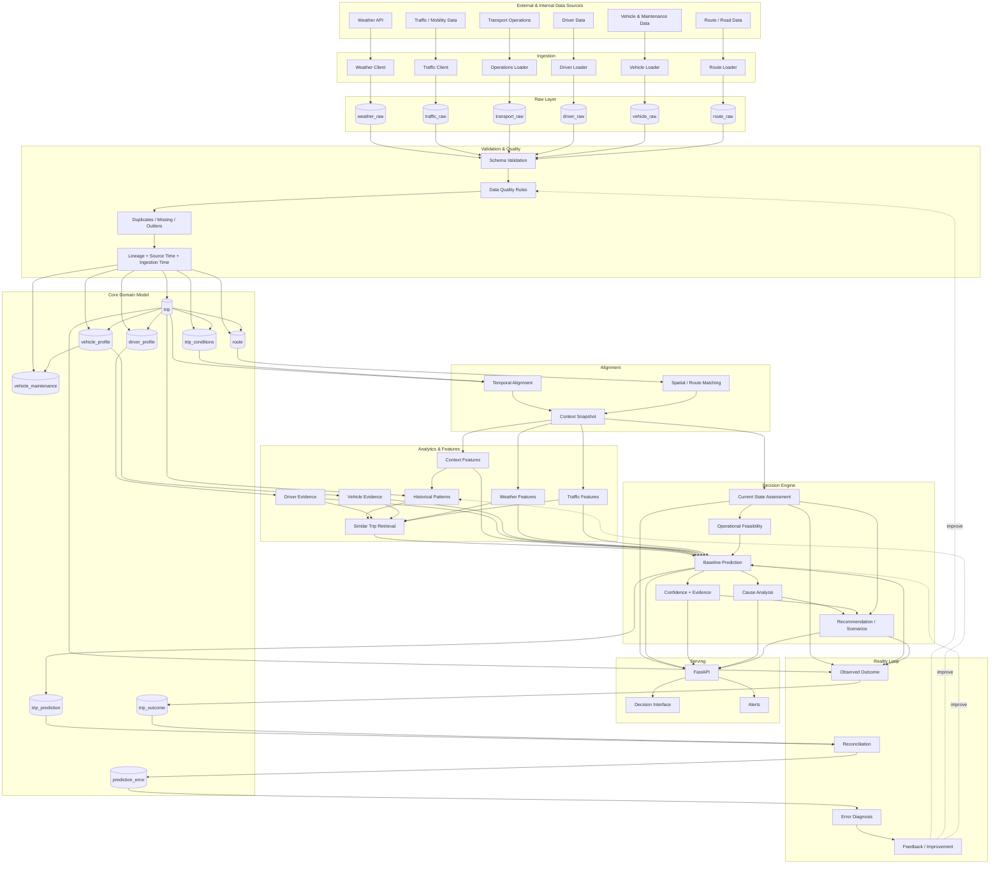

# OMIND Mobility Intelligence — Master Architecture

**Version:** 0.2  
**Repository:** `MOBILITY_LOGISTIC`  
**Architecture status:** Foundation frozen; implementation begins from the data model.

## 1. Purpose

OMIND Mobility Intelligence is an end-to-end Data & AI decision system for mobility and logistics operations.

The system connects operational events with weather, traffic, route, driver, vehicle, cargo, and time context to produce explainable operational decisions.

```text
Observe → Validate → Align → Context → Assess State → Feasibility
      → Predict → Explain → Recommend → Act → Measure → Reconcile
      → Diagnose → Improve
```

---

## 2. Master Blueprint



---

## 3. Runtime Architecture

Phase 1 is intentionally a **single Python application with clear internal boundaries** rather than microservices.

```text
                    ┌──────────────────────┐
                    │      FastAPI API      │
                    └──────────┬───────────┘
                               │
                    ┌──────────▼───────────┐
                    │   Application Layer  │
                    │       services/      │
                    └──────────┬───────────┘
                               │
        ┌──────────────────────┼──────────────────────┐
        │                      │                      │
┌───────▼────────┐    ┌────────▼────────┐    ┌───────▼────────┐
│   Ingestion    │    │    Decision     │    │   Analytics    │
│   Validation   │    │     Engine      │    │   Alignment    │
└───────┬────────┘    └────────┬────────┘    └───────┬────────┘
        │                      │                     │
        └──────────────────────┼─────────────────────┘
                               │
                    ┌──────────▼───────────┐
                    │ Repository / DB Layer│
                    └──────────┬───────────┘
                               │
                         ┌─────▼─────┐
                         │  SQLite   │
                         └───────────┘
```

There is one application process, but responsibilities are separated so the system can later evolve without rewriting the domain.

---

## 4. Database Strategy

### Phase 1 — SQLite

SQLite is the development database because the current machine may not permit installation of a database server.

```text
Python
  ↓
SQLAlchemy
  ↓
SQLite file
```

The SQLite file belongs under `data/` locally and is not committed to Git.

### Future — PostgreSQL

The intended production migration is:

```text
SQLAlchemy-based repositories
          ↓
SQLite → PostgreSQL
```

The migration is deliberately isolated from business logic.

---

## 5. Layer Responsibilities

### Sources
External and internal producers of observations.

### Ingestion
Only source communication, parsing, retries, pagination/rate-limit handling, and raw capture. Ingestion does not make business decisions.

### Raw Layer
Preserves source payloads and source metadata before interpretation.

### Validation
Checks schemas, types, required fields, timestamp validity, duplicates, missing values, impossible values, freshness, and lineage.

### Core Domain
Represents trusted business entities such as trips, routes, drivers, vehicles, predictions, outcomes, and error records.

### Alignment
Transforms independently timed and located observations into context relevant to a trip or route segment.

### Analytics
Builds historical distributions, context features, and similar-trip retrieval inputs.

### Decision Engine
Separates:

```text
Current State
    ↓
Feasibility
    ↓
Prediction
    ↓
Explanation
    ↓
Recommendation
```

### Serving
FastAPI exposes stable application interfaces. UI and alerts consume the same decision outputs rather than implementing business logic themselves.

### Feedback
Actual outcomes are stored separately, reconciled with predictions, diagnosed, and used to improve data quality, rules, or models.

---

## 6. Domain Model

### `trip`

Central transportation event.

```text
trip_id
route_id
driver_id
vehicle_id
start_timestamp
arrival_timestamp
distance_km
cargo_type
cargo_weight
delay_minutes
```

### `trip_conditions`

Time-indexed context associated with a trip.

```text
timestamp
traffic_level
traffic_volume
traffic_speed
temperature
precipitation
visibility
vehicle_status
```

### `driver_profile`

Driver identity/attributes plus evidence useful for historical comparison.

Do not collapse performance into one unexplained score.

### `vehicle_profile`

```text
vehicle_id
vehicle_type
model
manufacture_year
fuel_type
capacity
```

### `vehicle_maintenance`

```text
maintenance_id
vehicle_id
event_timestamp
maintenance_type
component
severity
downtime_hours
repair_cost
```

### `route`

Route identity and spatial representation. Exact geometry fields remain open until the initial real route source is selected.

### `trip_prediction`

```text
prediction_id
trip_id
prediction_timestamp
predicted_delay
predicted_travel_time
risk_level
confidence
model_version
```

Predictions are immutable records of system belief at a point in time.

### `trip_outcome`

```text
outcome_id
trip_id
actual_arrival
actual_delay
actual_traffic
actual_weather
vehicle_failure
incident
```

### `prediction_error`

```text
error_id
trip_id
prediction_id
predicted_value
actual_value
error_type
error_magnitude
possible_cause
source_issue
data_issue
model_issue
resolved
```

---

## 7. Time Alignment Rules

Alignment is variable-specific and must be derived from actual source semantics.

| Variable | Candidate strategy |
|---|---|
| Temperature | nearest / interpolation |
| Humidity | nearest / short-window average |
| Precipitation | interval aggregation |
| Visibility | nearest / conservative interval statistic |
| Traffic volume | interval average |
| Traffic speed | average / weighted average |
| Traffic level | representative state / mode |
| Incident | existence in interval |
| Road closure | active status during interval |

There is no universal nearest-timestamp rule.

---

## 8. Spatial Alignment

Relevant strategies may include:

- route ID matching
- route segment matching
- nearest observation point
- geographic proximity
- route geometry intersection

The first implementation will use the simplest defensible strategy supported by the selected real data sources.

---

## 9. Historical Context

A new trip should be compared with contextually similar history, not simply all historical records.

Candidate dimensions:

- route
- departure hour
- day-of-week
- season / holiday context
- weather
- traffic
- cargo
- vehicle
- driver history
- operational conditions

Driver and vehicle evidence can be evaluated across recent, longer-term, and all-valid-history windows when sample size justifies it.

Useful distribution summaries include sample size, median, quartiles, spread, and mean where appropriate.

---

## 10. Current State and Feasibility

Current-state assessment answers:

```text
What is happening now?
How fresh is the observation?
Is the route available?
Is the vehicle operational?
Is there an active incident?
```

Feasibility answers whether an action can actually be executed.

For a vehicle failure:

```text
Failure detected
      ↓
Safety / mobility check
      ↓
Failure severity
      ↓
Repair ETA / downtime
      ↓
Mechanic / parts availability
      ↓
Alternative vehicle
      ↓
Future conditions
      ↓
Scenario comparison
```

---

## 11. Prediction Strategy

The first model must be transparent and measurable.

Baseline candidates:

1. historical median by route/time context
2. similar-trip retrieval
3. simple statistical regression
4. tree-based models only after feature quality is established

Model complexity is justified only when it produces measurable improvement against the baseline.

---

## 12. Evidence and Explanation

Every prediction should be traceable to:

- comparable sample size
- current-data freshness
- relevant variables
- historical pattern
- model/rule version
- missing or unreliable inputs

The decision layer should be able to answer:

> **Why was this recommendation made?**

---

## 13. Feedback and Error Diagnosis

```text
Prediction
    ↓
Trip occurs
    ↓
Observed outcome
    ↓
Reconciliation
    ↓
Error measurement
    ↓
Root-cause classification
```

Potential causes include stale data, source errors, temporal mismatch, spatial mismatch, unexpected events, feature problems, model error, and decision/rule error.

A source-quality failure and a model failure are distinct engineering problems and must be diagnosed separately where possible.

---

## 14. Repository Architecture

```text
MOBILITY_LOGISTIC/
│
├── app/
│   ├── api/          # HTTP boundary
│   ├── core/         # configuration and shared contracts
│   ├── db/           # SQLAlchemy, models, repositories, sessions
│   ├── ingestion/    # source clients + ingestion workflows
│   ├── validation/   # schema + data quality
│   ├── alignment/    # temporal + spatial alignment
│   ├── analytics/    # history + feature engineering
│   ├── decision/     # state + feasibility + prediction + recommendation
│   └── services/     # orchestration across modules
│
├── data/
│   ├── raw/
│   ├── processed/
│   └── synthetic/
│
├── docs/
│   ├── architecture.md
│   ├── project-structure.md
│   ├── data-model.md
│   └── decisions.md
│
├── scripts/
├── tests/
│   ├── unit/
│   ├── integration/
│   └── data_quality/
│
├── migrations/
├── .github/workflows/
├── pyproject.toml
└── .env.example
```

Each directory exists because it owns a system responsibility. Empty placeholder folders should be minimized.

---

## 15. Implementation Sequence

```text
1. Define source contracts
2. Freeze domain model
3. Define SQLite schema
4. Create package structure
5. Create application configuration
6. Implement one real ingestion path
7. Store raw observations
8. Validate observations
9. Load trusted domain entities
10. Implement temporal/spatial alignment
11. Build historical context
12. Implement current-state assessment
13. Implement feasibility checks
14. Implement transparent baseline prediction
15. Store predictions
16. Store outcomes
17. Reconcile and diagnose errors
18. Add FastAPI endpoints
19. Add tests
20. Add observability
21. Migrate to PostgreSQL when operationally justified
22. Add advanced ML/optimization only after baseline evidence
```

---

## 16. Architecture Decisions Frozen for Phase 1

- One Python application, not microservices.
- SQLite locally; database access through SQLAlchemy.
- Raw data is separated from trusted domain data.
- Current state is separated from historical context.
- Feasibility precedes optimization.
- Predictions and outcomes are stored separately.
- Error diagnosis distinguishes source/data issues from model/decision issues.
- Advanced ML is deferred until the baseline works.

Open decisions such as the exact external providers, geography, route geometry, and final prediction algorithm remain evidence-driven.
