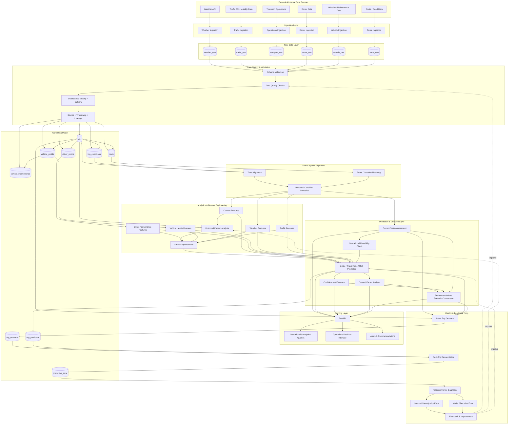

# OMIND Mobility Intelligence — Master Architecture

**Version:** 0.1  
**Repository:** `MOBILITY_LOGISTIC`

## 1. System Purpose

OMIND Mobility Intelligence is an end-to-end Data & AI decision system for mobility and logistics operations.

Its purpose is to connect operational reality with environmental and mobility context, then transform that context into explainable operational decisions.

```text
Observe
   ↓
Validate
   ↓
Align
   ↓
Context
   ↓
Assess State
   ↓
Check Feasibility
   ↓
Predict
   ↓
Explain
   ↓
Recommend
   ↓
Act
   ↓
Measure Reality
   ↓
Diagnose
   ↓
Improve
```

---

## 2. Master Blueprint



---

## 3. Layer Responsibilities

### 3.1 Sources

The system consumes two broad categories of data:

**External:** weather, traffic, mobility, route, road, incident and public datasets.

**Internal:** transport operations, driver, vehicle, maintenance and trip outcome data.

External data should be real and reproducible where possible. Internal data may initially be synthetic.

---

### 3.2 Ingestion Layer

Each source gets a dedicated ingestion responsibility.

The ingestion layer handles:

- HTTP/API communication
- authentication where required
- pagination
- retries
- rate limits
- response parsing
- source timestamps
- ingestion timestamps
- raw payload preservation

Important distinction:

> **Request frequency is not an HTTP method.**

GET/POST/etc. describe interface semantics. Scheduling determines how often data is retrieved.

---

### 3.3 Raw Data Layer

Raw tables preserve source observations before analytical transformation.

Initial logical areas:

```text
weather_raw
traffic_raw
transport_raw
driver_raw
vehicle_raw
route_raw
```

Raw records should preserve enough metadata to answer:

- where did this observation come from?
- when did the source produce it?
- when did we ingest it?
- what did the source actually say?
- was the payload valid?

Raw data should not be silently rewritten because downstream interpretation changed.

---

### 3.4 Validation & Data Quality

Validation happens before data becomes trusted domain data.

Checks include:

- schema validation
- required fields
- type validation
- timestamp validity
- duplicate detection
- missing values
- impossible ranges
- outliers
- source freshness
- referential consistency
- source lineage

Data quality failures should be observable rather than hidden.

---

### 3.5 Core Data Model

The core model turns validated source observations into domain entities.

#### `trip`

The central transportation event.

Conceptually:

```text
trip_id
route_id
driver_id
vehicle_id
start_timestamp
arrival_timestamp
distance_km
cargo_type
cargo_weight
delay_minutes
```

#### `trip_conditions`

A time-indexed context record associated with a trip.

It represents the environmental/operational state observed during a trip rather than a single giant trip row.

Potential fields include:

```text
timestamp
traffic_level
traffic_volume
traffic_speed
temperature
precipitation
visibility
vehicle_status
```

#### `driver_profile`

Stores driver attributes and historical evidence.

Do not reduce the driver to an unexplained score.

Useful evidence may include:

- experience
- vehicle types operated
- trip count
- average speed
- delay distribution
- on-time rate
- recent vs long-term performance

#### `vehicle_profile`

Stores relatively stable vehicle characteristics.

```text
vehicle_id
vehicle_type
model
manufacture_year
fuel_type
capacity
```

#### `vehicle_maintenance`

Stores maintenance and failure events.

```text
maintenance_id
vehicle_id
event_timestamp
maintenance_type
component
severity
downtime_hours
repair_cost
```

#### `route`

Stores route identity and spatial characteristics.

The exact geometry model will be defined after the first real route data source is selected.

#### `trip_prediction`

Stores what the system predicted at a specific point in time.

A prediction is immutable evidence of what the system believed before the outcome was known.

Potential fields:

```text
prediction_id
trip_id
prediction_timestamp
predicted_delay
predicted_travel_time
risk_level
confidence
model_version
```

#### `trip_outcome`

Stores observed reality after the trip.

Potential fields:

```text
outcome_id
trip_id
actual_arrival
actual_delay
actual_traffic
actual_weather
vehicle_failure
incident
```

#### `prediction_error`

Stores the reconciliation and diagnosis of prediction vs reality.

Potential fields:

```text
error_id
trip_id
prediction_id
predicted_value
actual_value
error_type
error_magnitude
possible_cause
source_issue
data_issue
model_issue
resolved
```

---

## 4. Time Alignment

Different variables require different temporal treatment.

Examples:

| Variable | Possible alignment rule |
|---|---|
| Temperature | nearest / interpolation |
| Humidity | nearest / short-window average |
| Precipitation | interval aggregation |
| Visibility | nearest / conservative interval statistic |
| Traffic volume | interval average |
| Traffic speed | average / weighted average |
| Traffic level | representative state / mode |
| Accident | existence within interval |
| Road closure | status during interval |

The final rule must be determined from the actual source semantics.

No generic "nearest timestamp for everything" rule should be introduced.

---

## 5. Spatial Alignment

The system must determine whether an observation actually belongs to a trip's route context.

Possible strategies include:

- route ID matching
- road segment matching
- geographic proximity
- route geometry intersection
- nearest valid observation point

The chosen strategy depends on the selected data sources.

---

## 6. Historical Context

Historical context is not simply "all previous rows".

For a new trip, useful historical context can include:

- same route
- similar departure time
- same day-of-week context
- seasonal context
- similar weather
- similar traffic
- similar cargo
- similar vehicle
- comparable driver history
- similar operational conditions

Exact calendar date should normally have lower importance than the contextual pattern unless the date itself has operational meaning, such as a known holiday or event.

---

## 7. Driver and Vehicle Evidence

Performance should be represented with distributions and multiple time windows where useful.

For example:

```text
Recent window
Long-term window
All valid history
```

The system should retain:

- sample size
- median
- quartiles
- mean where appropriate
- variance/spread
- relevant failure/event counts

This avoids making decisions from a tiny or atypical sample.

---

## 8. Current State Assessment

Before prediction, the system must establish what is actually happening now.

Example questions:

```text
Is the vehicle operational?
Can it move safely?
Is there an active incident?
Is the route available?
What are current traffic conditions?
What are current weather conditions?
How fresh are the observations?
```

Current-state assessment is distinct from forecasting.

---

## 9. Operational Feasibility

Feasibility comes before optimization.

For a vehicle failure, for example, the system should establish:

```text
Failure detected
      ↓
Can vehicle move safely?
      ↓
Failure severity
      ↓
Repair ETA / downtime
      ↓
Parts / mechanic availability
      ↓
Alternative vehicle availability
      ↓
Future route / traffic / weather
      ↓
Only then: scenario comparison
```

A recommendation that cannot actually be executed is not a useful recommendation.

---

## 10. Prediction Layer

The initial prediction layer should start with a transparent baseline.

Possible targets:

- delay minutes
- travel time
- probability of significant delay
- operational risk category

The project should not introduce complex ML before a strong baseline exists.

Baseline candidates can include:

- historical median by route/time context
- comparable-trip retrieval
- simple statistical regression
- tree-based models after feature quality is established

Model complexity must be earned by measurable improvement.

---

## 11. Confidence & Evidence

A prediction without context about its reliability is incomplete.

Confidence should consider factors such as:

- amount of comparable historical data
- similarity of historical observations
- freshness of current data
- missing inputs
- source reliability
- model performance in comparable contexts

The system should be able to answer:

> **Why should I trust this recommendation?**

---

## 12. Cause Analysis

The system should identify relevant factors rather than only outputting a number.

Example explanation:

```text
Expected delay: 24–35 min

Main contributing factors:
- high traffic volume on route segment A
- heavy precipitation
- low visibility
- historical delays under similar conditions

Evidence:
- 37 comparable trips
- 72% experienced >20 min delay
- current observations are 4 minutes old
```

The exact explanation mechanism will evolve with the model architecture.

---

## 13. Recommendation Layer

The recommendation layer converts state + prediction + evidence into operational options.

Examples:

```text
Option A: depart now
Option B: delay departure by 20 minutes
Option C: assign another vehicle
Option D: use alternate route
```

Each scenario should expose its assumptions and expected effect.

---

## 14. Reality & Feedback Loop

After a trip ends, the system should retrieve or ingest the actual outcome.

```text
Prediction
    ↓
Trip happens
    ↓
Observed outcome
    ↓
Reconciliation
    ↓
Prediction error
    ↓
Root-cause classification
```

Potential error categories:

- source error
- stale data
- temporal alignment error
- spatial matching error
- unexpected event
- data quality problem
- feature issue
- model error
- decision/rule error

The system must distinguish these where possible.

A prediction that was wrong because traffic data became stale is not the same engineering failure as a model that consistently underestimates delays.

---

## 15. Serving Layer

The first service boundary is expected to be FastAPI.

Potential endpoint groups:

```text
/api/v1/health
/api/v1/trips
/api/v1/routes
/api/v1/drivers
/api/v1/vehicles
/api/v1/current-state
/api/v1/predictions
/api/v1/recommendations
/api/v1/outcomes
/api/v1/errors
```

Exact endpoints will be defined after the database contracts are frozen.

---

## 16. Architectural Decisions Still Open

These are intentionally unresolved until evidence is collected:

1. Exact external weather provider
2. Exact traffic/mobility provider
3. Initial geographic scope
4. Route geometry representation
5. Operational database vs analytical database separation
6. Batch vs streaming ingestion boundaries
7. Baseline prediction algorithm
8. Recommendation optimization method
9. UI technology
10. Deployment target

These should not be guessed prematurely.

---

## 17. Implementation Order

The correct implementation sequence is:

```text
1. Data source contracts
2. Domain model
3. PostgreSQL schema
4. Project folder structure
5. Configuration management
6. Ingestion clients
7. Raw storage
8. Validation
9. Core data loading
10. Time/spatial alignment
11. Historical retrieval
12. Current-state engine
13. Baseline prediction
14. Outcome reconciliation
15. Error diagnosis
16. FastAPI
17. Tests
18. Docker / CI
19. UI
20. Advanced ML / optimization
```

The project should not jump directly from API ingestion to an ML model.

---

## 18. Engineering Standard

Every major component should have explicit:

```text
Responsibility
Inputs
Outputs
Dependencies
Failure modes
Tests
Observability
```

The repository should remain understandable to another engineer without requiring private verbal explanations.
